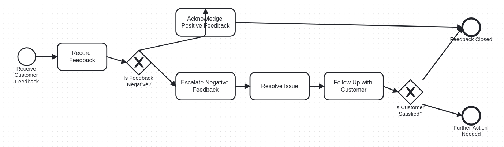
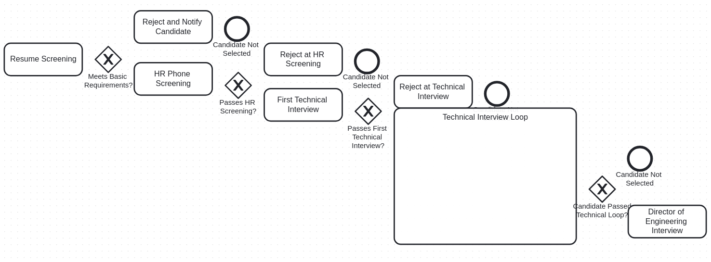
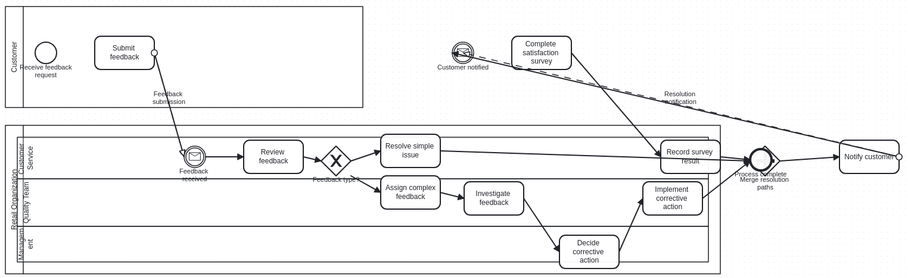
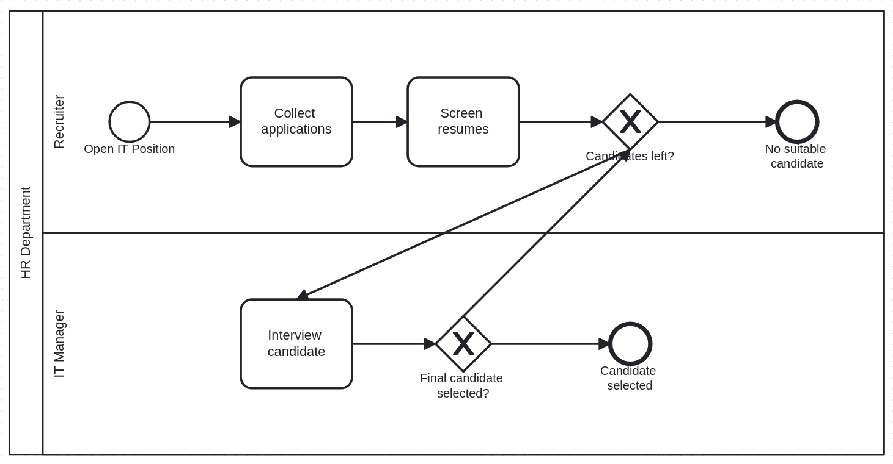
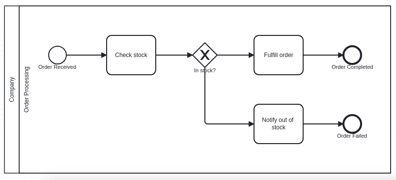

# BPMN Generator

A proof-of-concept command-line tool that converts natural-language process descriptions into valid BPMN 2.0 diagrams (XML .bpmn files) using a Large Language Model (GPT-4.1).

## Set up

### Prerequisites
- Python 3.x
- Node.js

### Installation on Linux

1. Enter the project folder
2. Create a Python virtual environment:
   ```bash
   python -m venv venv
   source venv/bin/activate  
   ```
3. Install the cli tool (and it's dependencies) in develop mode:
   ```bash
   pip install -e .
   ```
4. Create a `.env` file following the `.env.example` structure

### Project Structure

```
Text2BPMN/
├── assets/                    
│   ├── examples/ 
|   └── images/
├── layout_service/           
├── src/                  
│   ├── core/
|   |    ├── generator.py 
|   |    ├── layout.py               
|   |    ├── llm.py 
|   |    ├── merger.py 
|   |    └── validator.py 
│   ├── prompts/
│   ├── utils/
│   ├── cli.py                         
│   ├── config.py
│   └── exceptions.py          
├── tests/
├── .env
├── README.md
├── requirements.txt         
└── setup.py
```

## Input & Output

**Input:**

* Process description as a string, `.txt`, or `.md`
* Optional: output path for the generated file

**Output:**

* A `.bpmn` XML file saved to `./output/process_diagram.bpmn`
  or to the user-specified location
* STDOUT short validation report (about required elements of bpmn)


### Usage Examples

```bash
# Direct string input
text2bpmn "User logs in, system validates, show dashboard"

# From text file
text2bpmn --file process.txt

# From markdown with custom output
text2bpmn --file ./myfolder/process.md --output diagram.bpmn
```

## Approach

### Tech Stack
- **click**: CLI framework
- **LangChain**: LLM orchestration
- **Azure OpenAI**: LLM provider (GPT-4.1)
- **bpmn-auto-layout**: Diagram layout generation
- **pytest**: Testing framework

### Architecture

The tool is built around these core services:

1. **BPMNGeneratorService**: Orchestrates the entire BPMN generation pipeline
2. **LLMService**: Manages LLM API configuration and prompt execution
3. **BPMNMerger**: Combines individual lane XMLs into a complete BPMN file
4. **BPMNLayoutService**: Applies automatic layout (diagram) to single lane bpmn files
5. **XMLValidator**: Static utilities for validating XML integrity

### Assumptions

* Input is an English business process description
* Length: 10–10,000 characters
* Supported formats: `.txt`, `.md`, or raw text
* Process contains **one pool**

### Pipeline Overview

#### Step 0: Input normalization
- Convert input into a clean string
- The string is passed to BPMNGeneratorService

#### Step 1: Generate Process JSON
The input description is sent to the LLM (using `01_generate_json.txt` prompt) to produce a structured JSON representation.

Note that the process contains a pool that is divided in a list of lanes, and a list of sequence flows.

```json
{
"bpmn": {
    "process": {
    "id": "string (use snake_case)",
    "name": "string (human-readable process name)",
    "pool": {
        "id": "string (unique identifier)",
        "name": "string (actor/department name)"
        "lanes": [
        {
            "id": "string (unique identifier)",
            "name": "string (sub-actor or role)",
            "order": 0,
            "elements": [
            {
                "id": "string (unique identifier)",
                "type": "startEvent|endEvent|task|exclusiveGateway|inclusiveGateway|parallelGateway|intermediateEvent",
                "name": "string (short, action-based for tasks)",
                "eventType": "string (for events: none|message|timer|error|conditional)"
            },
            ]
        }
        ],
        "sequenceFlows": [
        {
            "id": "string (unique identifier)",
            "sourceRef": "identifier of the source element",
            "targetRef": "identifier of the target element",
            "name": "string (optional - condition label for gateway branches)",
            "conditionExpression": "string (optional - for XOR branches)"
        }
        ]
    }
    }
},
"reasoning": "a validation report (states if the required elements (at least one StartEvent, EndEvent, participant, and process) are stated in the process description. If they are not stated, write how your reasoning created one. If stated, write their correspondent natural language name in the process description)"
}
```

#### Step 2: Extract Lanes
- Separate sequence flows into intra-lane and inter-lane connections
- Extract each lane from the json as an independent process:
    - extract the lane and wrap in a process element
    - add intra-lane sequence flows 
    - add of mock start and end events if not present 

**Why mock start/end events?**
They ensure each lane has proper entry/exit points for layout purposes, making the bpm-auto-layout service work correctly.

#### Step 3: Generate Lane XMLs
For each lane:
- Convert JSON to BPMN XML using the LLM (`02_generate_little_xml.txt` prompt)
- Validate XML structure using XMLValidator

#### Step 4: Merge and Layout
Merge all BPMN XML lanes into one XML BPMN using BPMNMerger:
- For each lane:
    - Call the BPMNLayoutService to apply auto-layout 
    - Add lane shape (rectangle with lane name wrapping lane's elements) to the diagram (`add_lane_shape` function)
- Merge all lanes into a single XML file (`merge_xml_lanes` function)
- Add inter-lane sequence flows (`add_sequence_flows_from_json` function)
- Add pool representation (rectangle with pool name wrapping lanes) to complete the BPMN structure (`add_pool_to_bpmn` function)

#### Step 5: Return Result

Save the xml bpmn content inside the specified output folder (default: `process_diagram.bpmn`) and stdout the validation report.


## Experiments

My experimentation path focused on understanding BPMN structure, XML semantics, and LLM behavior.

#### Key insight about BPMN XML:

* `definitions` block → structural elements (process, lanes, events, flows…)
* `diagram` block → visual instructions (coordinates, shapes definitions)

### Experiment 1 — Baseline Direct XML Generation

**Approach**:
* Prompt LLM directly with BPMN general rules + process description to generate a BPMN XML file.
* Added XML validation of the output in order to obtain BPMN 

**Results**: 
- Model produced plausible events/tasks names in the XML
- Files could be opened in bpmn.io
- Major issues with diagram layout especially if the process is complex and long:
  - Arrows starting/ending in empty space
  - Overlapping elements/arrows
  - Disconnected components

**Insights**: LLMs understand BPMN concepts but struggle with precise spatial positioning.

<p align="center">
  
</p>

<p align="center">
  
</p>

### Experiment 2 — JSON → XML via LLM

**Approach**: Two-stage generation:
1. LLM generates structured JSON
2. LLM converts JSON to BPMN XML

**Results**: 
- Initial attempt with full process: Still messy layouts
- Lane-by-lane generation: Some improvement but graphical issues persisted
- Attempted XML of lanes merging via LLM: Failed to produce coherent diagrams

**Insight**: The graphical/spatial aspect of BPMN is fundamentally difficult for LLMs. A programmatic solution was needed.

<p align="center">
  
</p>

**Why JSON as an intermediate format?**
LLMs handle structured formats better than verbose XML. JSON provides a clear, unambiguous representation that reduces generation errors.

### Experiment 3 — Using bpmn-auto-layout

**Approach**: Use the [bpmn-auto-layout](https://github.com/bpmn-io/bpmn-auto-layout) Node.js library to handle diagram positioning.

**Challenge**: The library cannot handle multiple lanes in a single diagram.

**Solution**: This limitation led to the divide-and-conquer approach.

### Experiment 4 — Divide-and-Conquer (Final Pipeline)

**Approach**: 
1. Generate process JSON (single LLM call)
2. Generate XML for each lane separately (LLM call for each one)
3. Apply auto-layout to each lane
4. Programmatically merge lanes into complete BPMN

**Results**: Significantly improved visual clarity and structural validity.

**Insights**:
To ensure a correct LLM generation of xml lanes, it helped a lot instructing the llm in a explicit way to:
- Close definition tags
- Request no collaboration elements in lane XMLs
- Provide targeted examples for each generation stage

### Rejected Approaches

**Preprocessing step**

I kept the validation report reasoning about the process description in the first LLM request—the one generating the JSON—because it's the only point where the model has full access to both the user’s description and its own reasoning for creating the BPMN.

**Preprocessing step**
Attempted to have the LLM reformulate the process description for clarity. This degraded results rather than improving them. I discarded multi-step preprocessing approaches.

**Iterative refinement**
Asking the LLM to review and fix its own XML output did not yield improvements.

**Parameter tuning**
Changing temperature or other parameters had minimal impact, so I used a single, fixed LLM configuration for all requests.


## Evaluation (how I checked quality)

### Quality Assessment Criteria

I evaluated outputs using three key dimensions:

* **Readability:** Are diagrams clear and non-overlapping?
* **Completeness:** Do all described activities appear?
* **Structural validity:** Start/end events, gateways, sequence flows behave correctly

I did not consider generation time as a significant factor, since this task replaces manual user work and is never particularly slow. The number of LLM calls—and therefore the cost—scales with the number of lanes detected and the length of the user’s input.

Currently, each generation costs only a few cents, which seems acceptable, though it ultimately depends on how the tool will be used (e.g., token-based billing, monthly fee, etc.). It will most likely be part of a paid monthly tool suite for companies, and estimating the average generation cost can help determine an appropriate monthly price for customers.

### Evaluation Methods

BPMN diagram quality is difficult to quantify programmatically, especially the visual aspects. Maybe there exists some state-of-the-art evaluation process for BPMN files (like "element connectivity score"), further research about this could be made.

I eveluated in a non-quantitative way:

**Visual inspection**: Manually reviewed generated diagrams against various teset inputs. Overlapping elments or lanes were considered critical failures.

**Informal user testing**: Showed results to colleagues unfamiliar with the project to gauge comprehension.

**Qualitative comparison**: Since there's no single "correct" BPMN representation for most processes, I compared outputs from different pipeline approaches rather than against a ground truth.


## Lessons & Examples

### Key Lessons Learned

1. **LLMs excel at structure, struggle with syntax**: GPT-4.1 understands process descriptions well but makes errors in exact XML syntax and spatial positioning.

2. **Layout is a hard problem**: Graphical representation requires geometric reasoning that's poorly suited to text-based LLMs. Specialized tools work better.

3. **Validation is crucial**: Step-by-step validation prevents cascading errors.

4. **Examples are powerful**: Providing concrete examples in prompts improved output quality.

5. **Decomposition works**: Breaking the problem into smaller subproblems (lanes) made each piece tractable.

### Interesting Behaviors

**Ambiguity handling**: When the input is vague, the LLM makes reasonable assumptions (e.g., inferring an implicit start event).

**Contradiction resolution**: The LLM attempts to reconcile conflicting information in the process description rather than failing.

### Generation Examples:

#### Example 1
**Input**:
    
    Can you describe a hiring process for an IT position that repeats candidate interviews until a final candidate is selected?

**Output**:

Validation Report: 

    Required elements identified and mapped: StartEvent ('Open IT Position'), EndEvent ('Candidate selected'), EndEvent for exception ('No suitable candidate'), participant (HR Department as single pool), and process (Hiring Process for IT Position). The process description did not explicitly mention start/end events, so they were inferred based on standard hiring process boundaries: opening a position (start) and either selecting a candidate or exhausting all options (end). The iterative interview loop is represented by gateways and sequence flows. Lanes were created for Recruiter and IT Manager to reflect typical role separation in hiring.

Diagram:

<p align="center">
  
</p>

#### Example 2
**Input**:

    Write the process for handling online orders, including the path for out-of-stock items

**Output**:

Validation Report: 

    The process has one StartEvent ('Order Received') and two EndEvents ('Order Completed' for successful orders and 'Order Failed' for out-of-stock cases), which cover the required process boundaries. The main actor (Company) is used as the pool, as the Company is responsible for all order handling steps. There is one lane ('Order Processing'), since no distinct sub-roles are mentioned. The process description did not explicitly state the events; I inferred the start as 'Order Received' and created two ends for both possible process outcomes. All other steps (check stock, fulfill order, notify out-of-stock) were derived directly from the description.

Diagram:

<p align="center">
  
</p>


## Limitations / Next steps

### Current Limitations

1. **Single-pool constraint**: Only supports processes with one pool (participant). Multi pool processes will be represented by a single pool.
2. **Limited BPMN elements**: 
   - No extended task types (UserTask, SendTask, etc.)
   - No subprocesses
   - No annotations, associations, or groups
   - No activity calls or transactions
3. **Mock arrow artifacts**: Mock start/end events are removed, but their sequence flows remain, causing minor validation warnings in bpmn.io
5. **Arrows overlap**: Arrows overlap with each other making hard sometimes to understand the flow at first glance. Once moved a little it becomes clearer. Moreover current inter-lane arrows are straight and most of the times pass on top of other elements.
6. **Long Processes Issues**: A process with a very long and complex description outputs diagrams that are wrong in some steps, or hard to read.


### Proposed Next Steps

* Clean up mock artifacts
    Remove orphaned sequence flows when deleting mock events
* Expand tests and review Exceptions flow
* Strengthen validation rules (deeper BPMN XML rule checking)
* Provide more/better examples to LLM for both JSON and XML generation
* Add multi-pool support:
    The architecture naturally extends to multiple pools:
    - Modify JSON schema to include multiple pools and message flows
    - Apply existing lane-processing pipeline to each pool
    - Create algorithm to merge pools and add message flows between them
* Expand supported BPMN elements
* Input validation and clarification
    - Add guardrails for malicious or incomprehensible input
    - Implement follow-up questions to clarify ambiguous descriptions
    - Maintain conversation history until a complete description is obtained
    - Generate a final comprehensive description before BPMN generation
* Consider implementing a **custom layout engine** for full control over visual clarity (substituting/improving the bpmn-auto-layout library)

In order to establish better quality metrics we could take into consideration the collaboration with BPMN users.

## Additional Notes

### Algorithm Implementation Details

The following algorithms are used by BPMNMerger to construct the final BPMN XML:

#### `add_lane_shape`

Adds diagram information for a lane within the `bpmndi:BPMNPlane` element.

**Lane shape structure**:
```xml
<bpmndi:BPMNShape id="lane_id" bpmnElement="laneName" isHorizontal="true">
  <dc:Bounds x="190" y="85" width="1038" height="1000" />
  <bpmndi:BPMNLabel />
</bpmndi:BPMNShape>
```

**Calculation**:
1. Find min/max x and y coordinates across all elements in the lane
2. Compute dimensions:
   - `width = (max_x - min_x) + 60`
   - `height = (max_y - min_y) + 60`
3. Position the lane:
   - `x = min_x - 30`
   - `y = min_y - 30`

The padding (30px on each side) provides space for the lane label and visual separation.

#### `merge_xml_lanes`

Merges multiple lane XMLs into a single BPMN file by integrating lanes sequentially into the first XML.

**For each lane B being merged into lane A**:

1. **Clean up mock elements**: Remove mock start/end events from both process definitions and diagram sections

2. **Add lane structure**: Insert lane B's `<bpmn:laneSet>` and all its elements under the process definition in file A

3. **Adjust diagram positioning**:
   ```
   x_gap = lane_B_x - lane_A_x
   new_lane_B_x = lane_B_x - x_gap
   
   new_lane_B_y = lane_A_y + lane_A_height
   y_gap = lane_B_y - new_lane_B_y
   
   max_width = max(lane_B_width, lane_A_width)
   new_lane_A_width = max_width
   new_lane_B_width = max_width
   ```

4. **Transform element coordinates**:
   - For each element in lane B:
     - `x = x - x_gap`
     - `y = y - y_gap`
   - Width and height remain unchanged

This stacks lanes vertically while maintaining horizontal alignment.

#### `add_sequence_flows_from_json`

Adds inter-lane sequence flows to the merged BPMN XML.

**For each sequence flow**:

1. Add flow definition under the process element

2. Calculate waypoint coordinates based on relative positions:
   ```
   waypoint_1_x = sourceRef_x + (sourceRef_width / 2)
   waypoint_2_x = targetRef_x + (targetRef_width / 2)
   
   if sourceRef_y < targetRef_y:  # Source above target
       waypoint_1_y = sourceRef_y + sourceRef_height  # Bottom of source
       waypoint_2_y = targetRef_y                      # Top of target
   else:  # Target above source
       waypoint_1_y = sourceRef_y                      # Top of source
       waypoint_2_y = targetRef_y + targetRef_height  # Bottom of target
   ```

3. Add the edge to the diagram with the calculated waypoints

This creates arrows that flow naturally between vertically-stacked lanes.

#### `add_pool_to_bpmn`

Adds a collaboration element (pool) to represent the process participant.

**Steps**:

1. **Extract identifiers**:
   - `process_id` = existing process ID
   - `process_name` = existing process name
   - `participant_id` = "process_participant_1"
   - `collaboration_id` = "bpmn_collaboration_1"

2. **Add collaboration element** (before the process definition):
   ```xml
   <bpmn:collaboration id="bpmn_collaboration_1">
     <bpmn:participant id="process_participant_1" 
                       name="Process Name" 
                       processRef="process_id" />
   </bpmn:collaboration>
   ```

3. **Update diagram reference**: Change BPMNPlane's `bpmnElement` to the `collaboration_id`

4. **Calculate pool bounds**:
   ```
   x = (min x of all lanes) - 60  # Space for pool label
   y = min y of all lanes
   width = (width of first lane) + 60
   height = sum of all lane heights
   ```

5. **Add pool shape to diagram**:
   ```xml
   <bpmndi:BPMNShape id="participant_shape_1" 
                     bpmnElement="process_participant_1" 
                     isHorizontal="true">
     <dc:Bounds x="..." y="..." width="..." height="..." />
     <bpmndi:BPMNLabel />
   </bpmndi:BPMNShape>
   ```

This creates the outer container that groups all lanes under a single participant.
